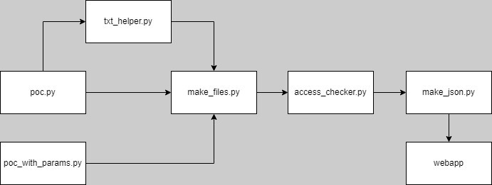

# Introduction
This repo is made for my Bachelor Thesis of 2023.
This tool lets you create a new file that will have a listener on it to check if it has been accessed by someone.

Ideally, you want to name it something the hacker might want to access like 'passwords.txt' (this is the default name, explained below).

This project has been made it Python 3.10 and will only work in versions matching or higher, because the `match` function has only been introduced in 3.10.

This POC is written for Windows and you'll need to install `pypiwin32` with pip.

# Important
Make sure to run this POC as an **ADMIN** because pyiwin32 needs Admin rights to work properly.
See "Common problems" as the bottom for more information.

# How to use for 1 file and params

`python3 poc.py`

It will ask for a filename, extension and path in the console.
Do **not** add a dot to the extension, this happens automatically

Example params:
- filename: test
- extension: txt
- path: C:/users/user/Desktop/

> This will create C:/users/user/Desktop/test.txt
>
> These files **cannot** be moved without breaking the code, so please select the correct folder on your first set-up.
> You'll have to add the last slash at the end of your path for this to work like the example

The default will be "passwords.txt" in the root folder, if nothing is supplied.

# How to use for multiple files

If you want to have multiple listeners and files for honeytokens it is recommended you use the following command. If you don't correctly fill in the parameters the program will not work properly, so it is best to properly read the documentation.

`start python3 python/poc_with_params.py -f test -e txt -p c:/users/user/Desktop/ &`

>If you want this to work properly, you'll have to be in the root folder of this project and do the above command from there. Otherwise the JSON file will be made in the wrong folder and nothing will work

This will create a test.txt file in the specified folder and will keep the listener up untill the file is accessed.

# Current support of file types
These files can have custom text in them, so they don't appear as 0kb files.
- `.txt`

# Flow

# Common problems
Your files might not be audited out of the box. The fix is:
Make sure that auditing is enabled for file access events in the Windows security policy. You can do this by following these steps:
1. Open the Local Security Policy editor (secpol.msc).
2. Navigate to Security Settings > Advanced Audit Policy Configuration > Audit Policies > Object Access.
3. Enable the "Audit File System" policy, and configure it to audit "Success" events.
4. Click Apply and OK to save the changes.
Try accessing the file as a different user, and then check the event log to see if the correct user name is logged.

*Don't forget to force the policy after it has been changed with `gpupdate /force`*